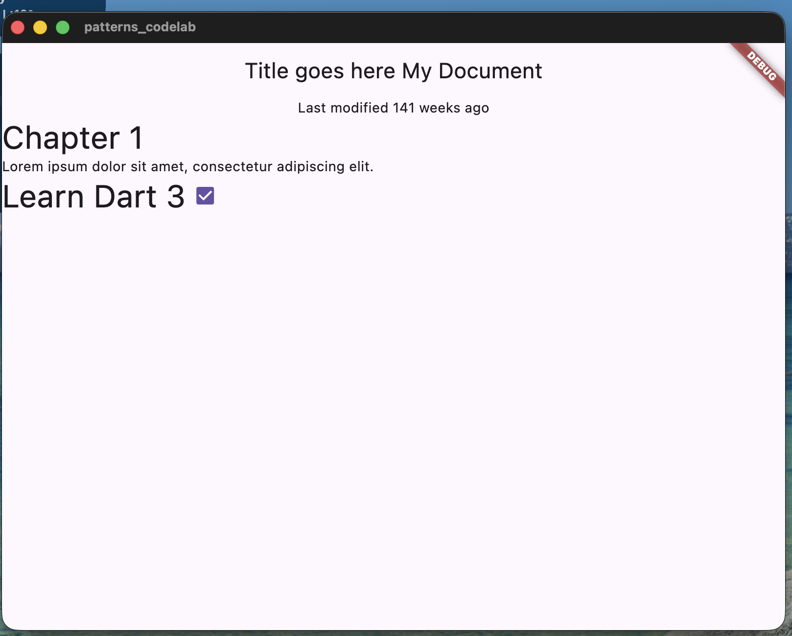

# patterns_codelab



Flutter project created to practice **Dart 3 Patterns & Records** using the official Google codelab:

**Dive into Dart's patterns and records**
[https://codelabs.developers.google.com/codelabs/dart-patterns-records#3](https://codelabs.developers.google.com/codelabs/dart-patterns-records#3)

---

## ✅ What I learned (with project examples)

### 1) Records (return multiple values)

Instead of creating a class just to return metadata, we returned a **record**:

```dart
(String, {DateTime modified}) get metadata {
  return ('My Document', modified: DateTime.now());
}
```

---

### 2) Destructuring records (unpack into local variables)

We unpacked the record into variables in one line:

```dart
final (title, :modified) = document.metadata;
```

Then used them directly in the UI:

```dart
Text(title);
Text('Last modified: $modified');
```

---

### 3) Read JSON safely using `if-case` + map patterns

Instead of many `if` checks and `as` casts, we validated and extracted values using patterns:

```dart
(String, {DateTime modified}) get metadata {
  if (_json case {
    'metadata': {'title': String title, 'modified': String modifiedString},
  }) {
    return (title, modified: DateTime.parse(modifiedString));
  }
  throw const FormatException('Unexpected JSON');
}
```

---

### 4) Map patterns ignore extra keys

Our JSON block may contain extra keys like `checked`, but the map pattern only matches what we need:

```dart
factory Block.fromJson(Map<String, dynamic> json) {
  if (json case {'type': final type, 'text': final text}) {
    return Block(type, text);
  }
  throw const FormatException('Unexpected JSON format');
}
```

---

### 5) Switch statements with patterns

We styled blocks based on their type:

```dart
switch (block.type) {
  case 'h1':
    textStyle = Theme.of(context).textTheme.displayMedium;
  case 'p' || 'checkbox':
    textStyle = Theme.of(context).textTheme.bodyMedium;
  case _:
    textStyle = Theme.of(context).textTheme.bodySmall;
}
```

---

### 6) Switch expressions (return a value directly)

The same logic became shorter and cleaner:

```dart
final textStyle = switch (block.type) {
  'h1' => Theme.of(context).textTheme.displayMedium,
  'p' || 'checkbox' => Theme.of(context).textTheme.bodyMedium,
  _ => Theme.of(context).textTheme.bodySmall,
};
```

---

### 7) Object patterns (match properties inside objects)

We formatted the modified date using a switch on a `Duration` object:

```dart
return switch (difference) {
  Duration(inDays: 0) => 'today',
  Duration(inDays: 1) => 'tomorrow',
  Duration(inDays: -1) => 'yesterday',
  Duration(inDays: final days, isNegative: true) => '${days.abs()} days ago',
  Duration(inDays: final days) => '$days days from now',
};
```

---

### 8) Guards (`when`) to add conditions after a match

We added weeks formatting using guards:

```dart
return switch (difference) {
  Duration(inDays: final days) when days > 7 =>
    '${days ~/ 7} weeks from now',

  Duration(inDays: final days) when days < -7 =>
    '${days.abs() ~/ 7} weeks ago',

  Duration(inDays: final days, isNegative: true) =>
    '${days.abs()} days ago',

  Duration(inDays: final days) =>
    '$days days from now',
};
```

---

### 9) `sealed` classes + exhaustive switching

We used `sealed` so Dart can enforce exhaustive `switch` handling of all block types.

**Sealed superclass + factory parsing:**

```dart
sealed class Block {
  Block();

  factory Block.fromJson(Map<String, Object?> json) {
    return switch (json) {
      {'type': 'h1', 'text': String text} => HeaderBlock(text),
      {'type': 'p', 'text': String text} => ParagraphBlock(text),
      {'type': 'checkbox', 'text': String text, 'checked': bool checked} =>
        CheckboxBlock(text, checked),
      _ => throw const FormatException('Unexpected JSON format'),
    };
  }
}
```

**Exhaustive UI rendering using object patterns:**

```dart
child: switch (block) {
  HeaderBlock(:final text) => Text(
    text,
    style: Theme.of(context).textTheme.displayMedium,
  ),
  ParagraphBlock(:final text) => Text(text),
  CheckboxBlock(:final text, :final isChecked) => Row(
    children: [
      Checkbox(value: isChecked, onChanged: (_) {}),
      Text(text),
    ],
  ),
}
```

---
